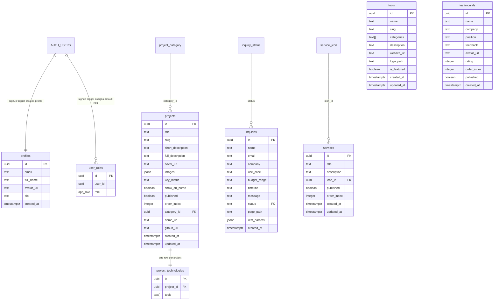

# Database Architecture

Last updated: 2026-06-01

## Scope

This document describes the current Supabase database architecture used by Quantix Studio.

It covers:

- the logical data model
- table purposes
- columns and relationships
- views, functions, enums, and triggers
- RLS behavior
- storage buckets tied to the application

## Source note

This document was assembled from project-local Supabase artifacts for the same project:

- `src/integrations/supabase/types.ts`
- `supabase/migrations/`
- `supabase/config.toml`

Direct live introspection from the connected Supabase MCP was not available in this session because the MCP endpoint was not authorized for schema reads.

Project reference:

- Set per copy in `supabase/config.toml` and `.env`.

## High-level architecture

The database can be split into six areas:

1. Identity and access control
2. Marketing site content
3. Portfolio and tool catalog
4. Lead capture and workflow support
5. AI / chat / document support tables
6. File storage buckets

## ER overview

## Core auth and access model

### `profiles`

Purpose:

- per-user profile data mirrored from `auth.users`
- editable by the user

Primary key:

- `id uuid`

Columns:

| Column | Type | Notes |
|---|---|---|
| `id` | `uuid` | matches `auth.users.id` |
| `email` | `text` | copied from signup, editable in app |
| `full_name` | `text` | sourced from signup metadata |
| `avatar_url` | `text` | public URL or storage path, nullable |
| `bio` | `text` | nullable |
| `created_at` | `timestamptz` | nullable in generated types |

Behavior:

- created automatically by `handle_new_user()`
- current frontend reads and updates this table for admin profile screens

RLS:

- users can view their own profile
- admins can view all profiles
- users can update their own profile
- users can insert their own profile if needed

### `user_roles`

Purpose:

- canonical RBAC mapping
- replaces the old dangerous `profiles.role` pattern

Primary key:

- `id uuid`

Columns:

| Column | Type | Notes |
|---|---|---|
| `id` | `uuid` | row id |
| `user_id` | `uuid` | references auth user logically |
| `role` | `app_role` | `admin`, `moderator`, `user` |

Important constraints and behavior:

- unique constraint on `(user_id, role)`
- default `user` role assigned by `handle_new_user_role()`

RLS:

- users can view their own roles
- only admins can manage roles

### Auth-related functions and triggers

#### `handle_new_user()`

Purpose:

- trigger function called after `auth.users` insert
- creates a row in `profiles`

#### `handle_new_user_role()`

Purpose:

- trigger function called after `auth.users` insert
- inserts default role `user` into `user_roles`

#### `has_role(_user_id uuid, _role app_role) -> boolean`

Purpose:

- main role-check helper for RLS policies

#### `is_admin() -> boolean`

Purpose:

- convenience helper used by some storage policies

## Marketing site content model

### `services`

Purpose:

- content blocks for services shown on the landing page

Primary key:

- `id uuid`

Columns:

| Column | Type | Notes |
|---|---|---|
| `id` | `uuid` | row id |
| `title` | `text` | service title |
| `description` | `text` | service copy |
| `icon_id` | `uuid` | current FK to `service_icon.id`, nullable |
| `order_index` | `integer` | visual ordering |
| `published` | `boolean` | public visibility |
| `created_at` | `timestamptz` | created timestamp |
| `updated_at` | `timestamptz` | updated timestamp |

Relationship:

- `icon_id -> service_icon.id`

RLS:

- public can read published services
- admins can manage all services

### `how_we_work`

Purpose:

- content blocks for the landing page "How We Work" section

Primary key:

- `id uuid`

Columns:

| Column | Type | Notes |
|---|---|---|
| `id` | `integer` | row id in the current remote table |
| `title` | `text` | stage title |
| `description` | `text` | stage body copy |
| `created_at` | `timestamptz` | created timestamp |
| `order` | `integer` | visual ordering and displayed step number source |

Current frontend mapping:

- cards are fetched from Supabase and ordered by `order`
- icon choice is derived in the frontend from `order`
- no `subtitle`, `icon_name`, or `published` column is currently present in the remote table

### `why_choose_us`

Purpose:

- content blocks for the landing page "Why Choose Quantix Studio" section

Primary key:

- `id bigint`

Columns:

| Column | Type | Notes |
|---|---|---|
| `id` | `bigint` | row id |
| `created_at` | `timestamptz` | created timestamp |
| `title` | `text` | card title |
| `description` | `text` | card body copy |
| `icon_name` | `text` | Lucide icon name used by the frontend |
| `order` | `integer` | visual ordering |

RLS:

- public can read rows
- admins can manage all rows

### `service_icon`

Purpose:

- lookup table for service icon metadata

Primary key:

- `id uuid`

Columns:

| Column | Type | Notes |
|---|---|---|
| `id` | `uuid` | row id |
| `name` | `text` | icon name |
| `icon_url` | `text` | optional icon asset URL |

RLS:

- public read allowed

### `testimonials`

Purpose:

- customer / client review content

Primary key:

- `id uuid`

Columns:

| Column | Type | Notes |
|---|---|---|
| `id` | `uuid` | row id |
| `name` | `text` | person name |
| `company` | `text` | nullable |
| `position` | `text` | nullable |
| `feedback` | `text` | testimonial body |
| `avatar_url` | `text` | storage path or URL, nullable |
| `rating` | `integer` | nullable, expected 1..5 |
| `order_index` | `integer` | visual ordering |
| `published` | `boolean` | public visibility |
| `created_at` | `timestamptz` | created timestamp |

RLS:

- public can read published testimonials
- admins can manage all testimonials

## Portfolio and catalog model

### `projects`

Purpose:

- portfolio projects shown publicly and editable in admin

Primary key:

- `id uuid`

Columns:

| Column | Type | Notes |
|---|---|---|
| `id` | `uuid` | row id |
| `title` | `text` | project title |
| `slug` | `text` | unique URL identifier |
| `short_description` | `text` | card/list summary |
| `full_description` | `text` | long-form body, nullable |
| `cover_url` | `text` | main image URL, nullable |
| `images` | `jsonb` | array of image objects |
| `key_metric` | `text` | highlight metric, nullable |
| `show_on_home` | `boolean` | featured on home page |
| `published` | `boolean` | public visibility |
| `order_index` | `integer` | sorting |
| `category_id` | `uuid` | nullable FK to `project_category.id` |
| `demo_url` | `text` | nullable |
| `github_url` | `text` | nullable |
| `created_at` | `timestamptz` | created timestamp |
| `updated_at` | `timestamptz` | updated timestamp |

Relationship:

- `category_id -> project_category.id`

JSON structure note:

- `images` is documented in migrations as an array of objects like:
  - `[{ "url": "...", "alt": "...", "is_main": true, "order": 0 }]`

RLS:

- public can read published projects
- admins can manage all projects

### `project_category`

Purpose:

- lookup table for portfolio categories

Primary key:

- `id uuid`

Columns:

| Column | Type | Notes |
|---|---|---|
| `id` | `uuid` | row id |
| `name` | `text` | category name |
| `description` | `text` | nullable |
| `order_index` | `integer` | sort order |

RLS:

- public read allowed

### `tools`

Purpose:

- catalog of tools/technologies shown in portfolio and landing sections

Primary key:

- `id uuid`

Columns:

| Column | Type | Notes |
|---|---|---|
| `id` | `uuid` | row id |
| `name` | `text` | display name |
| `slug` | `text` | URL-safe identifier |
| `categories` | `text[]` | one or more categories |
| `description` | `text` | nullable |
| `website_url` | `text` | nullable |
| `logo_path` | `text` | nullable storage path |
| `is_featured` | `boolean` | used by UI for highlight states |
| `created_at` | `timestamptz` | created timestamp |
| `updated_at` | `timestamptz` | updated timestamp |

Important schema evolution:

- older schema used a single category field
- current schema uses `categories text[]`
- migration adds constraints enforcing:
  - at least one category
  - only allowed category values

Observed allowed category values in migrations:

- `Frontend`
- `Backend`
- `Database`
- `AI`
- `Automation`
- `Design`
- `CMS`
- `Email & Marketing`
- `Analytics`
- `CRM / Business Tools`
- `Mobile`
- `SaaS`
- `Full-stack`

Note:

- generated types still contain a stale enum variant `Data base`
- the actual validation migration uses `Database`

### `project_technologies`

Purpose:

- current junction layer connecting projects to tools

Current modeling strategy:

- one row per project
- tool membership stored in `tools text[]`

Primary key:

- `id uuid`

Columns:

| Column | Type | Notes |
|---|---|---|
| `id` | `uuid` | row id |
| `project_id` | `uuid` | FK to `projects.id` |
| `tools` | `text[]` | array of tool IDs |

Relationship:

- `project_id -> projects.id`

Evolution note:

- older schema used `technology_id`
- migration renamed old field to `legacy_technology_id`
- current app expects the array-based `tools` model
- unique index ensures one row per `project_id`
- GIN index exists on `tools`

RLS:

- public read allowed
- admins can manage all rows

### `technologies`

Purpose:

- legacy lookup table from the pre-tools relationship model

Primary key:

- `id uuid`

Columns:

| Column | Type | Notes |
|---|---|---|
| `id` | `uuid` | row id |
| `name` | `text` | technology name |
| `description` | `text` | nullable |

Status:

- still present in generated types
- effectively legacy after the move to `tools`

RLS:

- public read allowed

### View: `projects_with_tools`

Purpose:

- convenience view that returns projects with joined tool data

Behavior:

- starts from `projects`
- aggregates tool rows by unnesting `project_technologies.tools`
- returns `project_tools` as JSON

Permissions:

- `SELECT` granted to `authenticated` and `anon`

Important app note:

- current frontend does not use this view yet
- it still does manual multi-query composition in application code

## Lead capture and workflow support

### `inquiries`

Purpose:

- stores lead/contact inquiry submissions and metadata

Primary key:

- `id uuid`

Columns:

| Column | Type | Notes |
|---|---|---|
| `id` | `uuid` | row id |
| `name` | `text` | contact name |
| `email` | `text` | contact email |
| `company` | `text` | nullable |
| `use_case` | `text` | nullable |
| `budget_range` | `text` | nullable |
| `timeline` | `text` | nullable |
| `message` | `text` | inquiry body |
| `status` | `text` | FK to `inquiry_status.id` |
| `page_path` | `text` | nullable, source page |
| `utm_params` | `jsonb` | nullable campaign metadata |
| `created_at` | `timestamptz` | created timestamp |

Relationship:

- `status -> inquiry_status.id`

RLS:

- public can insert
- admins can view
- admins can update

Current product note:

- the current frontend contact form posts to an external n8n webhook
- the contact form does not currently insert into `inquiries` directly

### `inquiry_status`

Purpose:

- lookup table for inquiry workflow status values

Primary key:

- `id text`

Columns:

| Column | Type | Notes |
|---|---|---|
| `id` | `text` | status key |
| `label` | `text` | nullable display label |
| `color` | `text` | nullable UI color |
| `order_index` | `integer` | nullable sort order |

RLS:

- public read allowed

### `email_templates`

Purpose:

- email body and subject templates

Primary key:

- `id uuid`

Columns:

| Column | Type | Notes |
|---|---|---|
| `id` | `uuid` | row id |
| `name` | `text` | template name |
| `subject` | `text` | email subject |
| `html_content` | `text` | full HTML body |
| `created_at` | `timestamptz` | nullable |
| `updated_at` | `timestamptz` | nullable |

### `email_logs`

Purpose:

- audit/log rows for sent emails

Primary key:

- `id uuid`

Columns:

| Column | Type | Notes |
|---|---|---|
| `id` | `uuid` | row id |
| `resend_id` | `text` | provider message id |
| `to_email` | `text` | recipient |
| `subject` | `text` | nullable |
| `template_name` | `text` | nullable |
| `status` | `text` | nullable |
| `HTML` | `text` | nullable HTML body copy |
| `sent_at` | `timestamptz` | nullable |

## AI, document, and chat support tables

### `documents`

Purpose:

- stores document content and embeddings for AI / retrieval use cases

Primary key:

- `id bigint`

Columns:

| Column | Type | Notes |
|---|---|---|
| `id` | `bigint` | row id |
| `content` | `text` | nullable |
| `embedding` | `text` | nullable in generated types |
| `metadata` | `jsonb` | nullable |
| `created_at` | `timestamptz` | created timestamp |

### `long_chat_history`

Purpose:

- stores chat exchanges in expanded row format

Primary key:

- `id bigint`

Columns:

| Column | Type | Notes |
|---|---|---|
| `id` | `bigint` | row id |
| `chat_id` | `bigint` | nullable grouping id |
| `username` | `text` | nullable |
| `user_message` | `text` | nullable |
| `agent_message` | `text` | nullable |
| `created_at` | `timestamptz` | created timestamp |

### `n8n_chat_histories`

Purpose:

- stores chat data in message-json format, likely for workflow automation

Primary key:

- `id bigint`

Columns:

| Column | Type | Notes |
|---|---|---|
| `id` | `bigint` | row id |
| `session_id` | `text` | nullable |
| `message` | `jsonb` | nullable |
| `created_at` | `timestamptz` | created timestamp |

## Enums

### `app_role`

Values:

- `admin`
- `moderator`
- `user`

Use:

- `user_roles.role`
- `has_role()` checks
- multiple RLS policies

### `tools_category`

Status:

- present in generated types
- appears to be legacy or partially stale

Reason:

- current `tools.categories` field is `text[]` with CHECK constraints, not an enum column

## RLS summary by table

| Table | Public Read | Public Insert | Auth Read | Admin Manage |
|---|---|---|---|---|
| `profiles` | no | no | own profile | partial, view all |
| `user_roles` | no | no | own roles | yes |
| `services` | published only | no | yes through public policy | yes |
| `projects` | published only | no | yes through public policy | yes |
| `testimonials` | published only | no | yes through public policy | yes |
| `project_category` | yes | no | yes | not explicitly summarized here |
| `project_technologies` | yes | no | yes | yes |
| `service_icon` | yes | no | yes | not explicitly summarized here |
| `technologies` | yes | no | yes | not explicitly summarized here |
| `inquiries` | no | yes | admins only | admins update/view |
| `inquiry_status` | yes | no | yes | not explicitly summarized here |

## Storage architecture

### Buckets confirmed in migrations

#### `portfolio`

Purpose:

- project cover images and gallery images

Access pattern:

- public read
- admin upload/update/delete

#### `avatars`

Purpose:

- user profile avatars

Access pattern:

- public read
- authenticated users manage files inside their own folder path

#### `service-icons`

Purpose:

- service icon assets

Access pattern:

- public read
- admin upload

#### `testimonials_avatars`

Purpose:

- testimonial avatar assets

Access pattern:

- public read
- admin upload/update/delete

Constraints:

- migration sets `file_size_limit = 2MB`
- allowed mime types are images

### Bucket used by code but not confirmed in local migrations

#### `tools_logos`

Observed in frontend code:

- yes

Observed in local migrations:

- not found

Meaning:

- either the bucket exists only in the remote Supabase project
- or the migration for it is missing from the repo

This should be verified before any schema cleanup or storage refactor.

## Current application data flows

### Auth flow

1. User signs up in Supabase Auth
2. `handle_new_user()` creates `profiles` row
3. `handle_new_user_role()` creates default `user_roles` row
4. Frontend reads `profiles` and `user_roles` for session-aware UI

### Portfolio flow

1. Public UI reads published `projects`
2. UI joins category from `project_category`
3. UI reads one `project_technologies` row per project
4. UI resolves tool IDs against `tools`

### Admin flow

1. Admin passes `has_role(..., 'admin')`
2. Admin can mutate `projects`, `testimonials`, `services`, `project_technologies`, and role-protected storage buckets

### Inquiry flow

1. Live marketing form sends payload to external n8n webhook
2. `inquiries` table exists but is not currently the direct submission path from the main public form

## Notable schema evolution points

1. RBAC moved out of `profiles.role` into `user_roles`
2. `projects.category` evolved into `projects.category_id`
3. old JSON and normalized technology patterns evolved into the current `tools` catalog plus `project_technologies.tools[]`
4. `projects.images` was introduced to support multi-image galleries
5. stricter profile visibility policies were added later for security
6. `projects_with_tools` view was added but is not yet used by the frontend

## Practical guidance for future work

- Treat `supabase/migrations/` as the schema history source of truth.
- Treat `src/integrations/supabase/types.ts` as the app-facing typed snapshot, but assume it can drift.
- If schema changes are introduced later, regenerate Supabase types after the migration.
- Be careful with `project_technologies`: the current app assumes exactly one row per project.
- Verify the real state of `tools_logos` before touching tool asset flows.
